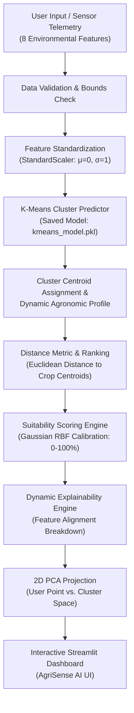

# AGRICULTURAL CROP CONDITION ANALYSIS
### Clustering-Based Crop Suitability Recommendation System
**Application Name:** AgriSense AI  
**Subtitle:** *Intelligent Crop Condition Analysis & Suitability Recommendation*  
**Domain:** Artificial Intelligence & Precision Data Science in Agriculture  

---

## 1. Project Overview

**AgriSense AI** is a production-quality, explainable Machine Learning application designed to assist farmers, agricultural planners, and agronomists in identifying the most suitable crops for given environmental and soil conditions. 

Rather than relying on manual lookup tables or unexplainable black-box models, the system employs **Unsupervised Machine Learning (K-Means Clustering)** to group agricultural crops according to multi-dimensional physiological and environmental requirements. Given user-specified environmental conditions (temperature, rainfall, humidity, soil moisture, soil pH, and N-P-K nutrient concentrations), the system scales the input, identifies the nearest cluster centroid in standardized feature space, computes Euclidean distances, and ranks suitable crops with calibrated **suitability scores (%)** and dynamic agronomic explanations.

---

## 2. Problem Statement

Selecting the optimal crop for a specific plot of land is a multi-criteria decision problem:
1. **Multi-Factor Interaction:** A crop's vegetative success depends on complex simultaneous interactions between thermal conditions, hydrological availability, soil reaction (pH), and macro-nutrients (N, P, K).
2. **Climate Variability:** Regional micro-climates diverge significantly from coarse district-level averages.
3. **Information Gap:** Farmers frequently lack accessible, data-driven tools that explain *why* specific crops are biologically and environmentally suited to their field conditions.

---

## 3. Proposed Solution & Objectives

The proposed solution implements an end-to-end unsupervised data science pipeline:
- **Discover Natural Agronomic Clusters:** Identify cohesive crop groups with shared ecological niches without human labeling bias.
- **Dynamic Cluster Interpretation:** Automatically profile clusters into human-understandable agronomic zones (e.g., *Wetland High Moisture*, *Semi-Arid Drought Tolerant*, *Nutrient-Dense Temperate*, *High-Potash Horticulture*).
- **Condition-Based Recommendation:** Map field measurements to the closest cluster and rank crops based on standardized distance metrics.
- **Interactive Visualizations:** Provide 2D PCA cluster space projections, interactive multi-dimensional radar charts, elbow curves, and correlation heatmaps.

---

## 4. System Architecture



---

## 5. Environmental Features & Agronomic Bounds

The model evaluates **8 core environmental parameters**:

| Parameter | Unit | Realistic Bound | Agronomic Significance |
| :--- | :---: | :---: | :--- |
| **Temperature** | °C | 0.0 – 55.0 | Governs metabolic and photosynthetic rates. |
| **Rainfall** | mm | 0.0 – 4500.0 | Primary hydrological source for rainfed cultivation. |
| **Humidity** | % | 0.0 – 100.0 | Dictates evapotranspiration demand and fungal pressure. |
| **Soil Moisture** | % | 0.0 – 100.0 | Volumetric root-zone moisture availability. |
| **Soil pH** | pH | 3.5 – 10.0 | Governs nutrient availability and microbial activity. |
| **Nitrogen (N)** | kg/ha | 0.0 – 300.0 | Primary macro-nutrient for vegetative and leaf biomass. |
| **Phosphorus (P)** | kg/ha | 0.0 – 300.0 | Critical for root establishment and energy transfer (ATP). |
| **Potassium (K)** | kg/ha | 0.0 – 300.0 | Regulates stomatal conductance, water stress, and tuber yield. |

### Crop Varieties Cataloged (22 Varieties):
- **Wetland / High Moisture:** Rice, Sugarcane, Banana, Jute, Coconut
- **Semi-Arid / Drought-Tolerant:** Millet (Bajra), Sorghum (Jowar), Chickpea, Pigeon Pea, Groundnut
- **Temperate & Sub-Tropical Cereals:** Wheat, Barley, Maize
- **Commercial & Oilseeds:** Cotton, Soybean, Mustard, Sunflower, Coffee
- **Horticultural & Vegetable:** Potato, Tomato, Onion, Garlic

> **Dataset Notice:** The default dataset (`data/crop_environment.csv`) contains 220 realistic records generated according to agronomic standards (ICAR/FAO profiles). To use real-world localized field datasets, simply replace `data/crop_environment.csv` with the same column schema.

---

## 6. Machine Learning Methodology

### 1. Feature Standardization (Z-Score Normalization)
Because features span vastly different scales (Rainfall: 300–2500 mm vs. Soil pH: 5.0–8.0), raw Euclidean distances would be completely distorted by rainfall. Features are standardized to zero mean ($\mu = 0$) and unit variance ($\sigma = 1$):

$$z = \frac{x - \mu}{\sigma}$$

### 2. K-Means Clustering Formulation
The K-Means algorithm partitions $N$ observations into $K$ disjoint clusters $S = \{S_1, S_2, \dots, S_K\}$, minimizing the Within-Cluster Sum of Squares (Inertia):

$$J = \sum_{k=1}^{K} \sum_{x \in S_k} ||x - \mu_k||^2$$

where $\mu_k$ is the centroid of cluster $S_k$.

### 3. Model Evaluation: Elbow Method & Silhouette Coefficient
- **Inertia (Elbow Method):** Evaluates reduction in WCSS across $K \in [2, 10]$ to find the point of diminishing returns.
- **Silhouette Coefficient ($s$):** Evaluates cluster cohesion $a(i)$ relative to nearest-neighbor separation $b(i)$:

$$s(i) = \frac{b(i) - a(i)}{\max(a(i), b(i))}$$

The application automatically identifies the optimal $K$ that maximizes silhouette separation.

### 4. Dimensionality Reduction with PCA
Principal Component Analysis (PCA) maps the 8-dimensional standardized space into orthogonal 2D eigenvectors:

$$PC_1, PC_2 = \arg\max \mathrm{Var}(X \cdot W)$$

This enables full 2D scatter visualization of cluster boundaries, crop locations, and the user's localized query coordinates.

### 5. Suitability Scoring & Explainability
For user input vector $u_{scaled}$ and crop centroid $c_{scaled}$, Euclidean distance is:

$$d = ||u_{scaled} - c_{scaled}||_2$$

Suitability score percentage is computed via a calibrated Gaussian similarity kernel ($\sigma = 2.0$):

$$S = 100 \cdot \exp\left(-\frac{d^2}{2\sigma^2}\right)$$

Suitability scores are categorized into:
- **Optimal Match:** $\ge 85\%$
- **Highly Favorable:** $70\% - 84\%$
- **Moderate Match:** $50\% - 69\%$
- **Marginal Match:** $< 50\%$

---

## 7. Project Structure

```
d:/AGRICULTURAL CROP CONDITION ANALYSIS/
├── app.py                     # Main Streamlit Dashboard Application
├── train_model.py             # CLI Pipeline Training & Diagnostic Script
├── create_notebook.py         # Automated Jupyter Notebook Generator
├── requirements.txt           # Project Dependencies
├── README.md                  # Comprehensive Academic & Technical Guide
│
├── data/
│   └── crop_environment.csv  # Agronomic Dataset (22 crops, 220 samples)
│
├── models/
│   ├── kmeans_model.pkl       # Serialized Trained K-Means Model
│   ├── scaler.pkl             # Serialized StandardScaler
│   ├── pca_model.pkl          # Serialized PCA Transformer
│   └── cluster_metadata.json  # Profiles, evaluation metrics & centroids
│
├── src/
│   ├── __init__.py
│   ├── data_preprocessing.py  # Data generation, validation & bounds checking
│   ├── clustering.py          # K-Means, Elbow, Silhouette, PCA & profiling
│   ├── recommendation.py      # Similarity ranking, scoring & explainability
│   └── visualization.py       # Interactive Plotly charts (PCA, Radar, Elbow)
│
├── notebooks/
│   └── crop_analysis.ipynb    # Walkthrough Jupyter Notebook for Viva
│
├── assets/
│   ├── agriculture_banner.png # Generated high-res precision agriculture banner
│   └── custom.css             # Modern agricultural dashboard stylesheet
│
└── tests/
    └── test_system.py         # Unit & Integration Pytest Suite
```

---

## 8. Installation & Deployment Guide

### Run Locally

#### Prerequisites
- Python 3.9+ (Tested on Python 3.10 – 3.14)
- Git & Pip package manager

#### Setup Steps:
```bash
# 1. Clone repository
git clone https://github.com/<your-username>/agrisense-ai.git
cd agrisense-ai

# 2. Install dependencies
pip install -r requirements.txt

# 3. (Optional) Run automated test suite
python -m pytest tests/test_system.py -v

# 4. Start the AgriSense AI web application
streamlit run app.py
```
*(If `streamlit` is not on your system PATH, run: `python -m streamlit run app.py`)*

Open your browser at: **`http://localhost:8501`**

---

### Deploy with Streamlit Community Cloud

**AgriSense AI** is structured for seamless 1-click deployment on [Streamlit Community Cloud](https://streamlit.io/cloud):

1. **Push to GitHub:** Ensure your code is pushed to a public GitHub repository named `agrisense-ai`.
2. **Log in to Streamlit Cloud:** Visit [share.streamlit.io](https://share.streamlit.io/) and connect your GitHub account.
3. **Create New App:**
   - **Repository:** `<your-username>/agrisense-ai`
   - **Branch:** `main`
   - **Main file path:** `app.py`
   - **App URL:** (Choose an available custom subdomain, e.g., `agrisense-ai.streamlit.app`)
4. **Advanced Settings (Python version):** Select Python 3.10, 3.11, or 3.12.
5. **Click "Deploy!":** Streamlit Cloud will automatically detect `requirements.txt`, install all required dependencies, load the theme from `.streamlit/config.toml`, and serve the app publicly.

> **CRITICAL DEPLOYMENT NOTE:** The pre-trained model artifacts inside `models/` (`kmeans_model.pkl`, `scaler.pkl`, `pca_model.pkl`, and `cluster_metadata.json`) along with `data/crop_environment.csv` are tracked in Git and **must remain committed** in the repository. This enables the cloud container to launch immediately without expensive cold-start retraining.

---

## 9. Viva / College Demonstration Flow

When demonstrating this project during an academic review or viva:

1. **Home / Overview Page:**
   - Highlight the problem of matching crops to multi-dimensional micro-climates.
   - Show the KPI cards: 22 Crops, K=4 Clusters, 8 Parameters, Silhouette Score ~0.24, 62.7% PCA variance.
   - Walk through the 6-step architecture diagram.
2. **Data Exploration Page:**
   - Show the dataset table with 220 validated agronomic records.
   - Switch to the *Correlation Heatmap* tab: explain the high correlation between Rainfall, Soil Moisture, and Humidity, justifying why `StandardScaler` is mathematically necessary.
3. **ML Model Page:**
   - Display the **Elbow Method Curve** (Inertia vs. K) and **Silhouette Score Chart**.
   - Explain how optimal $K=4$ was selected based on maximum cluster cohesion.
   - Show the mathematical formulations for Z-score, WCSS, and Silhouette coefficient.
4. **Cluster Analysis Page:**
   - Present the **Radar Chart**: explain how Cluster 0 (Wetlands) spikes on moisture, Cluster 1 (Arid) spikes on heat and collapses on moisture, and Cluster 3 (Cereals) shows balanced temperate features.
5. **Crop Analysis (Live Recommendation):**
   - Click one of the 4 quick viva presets (e.g., **"🌧️ Monsoon Wetland (Rice / Sugarcane)"**).
   - Click **"🔍 ANALYZE CROP CONDITIONS"**.
   - Show the predicted cluster: *High Moisture Wetland Group*.
   - Point out the ranked recommendations: **Rice (91.1% Optimal)**, **Jute (87.6%)**, **Sugarcane (73.2%)**.
   - Expand the **Explainability Accordion** to show exact aligned physiological factors.
   - Highlight the **2D PCA Chart** showing the user's localized query condition plotted as a star directly among the wetland crop cluster!

---

## 10. Academic Disclaimers & Limitations

- **Data-Driven Approximation:** Recommendations are calculated strictly through mathematical distance in standardized multi-feature space.
- **No Yield Guarantee:** The model does not guarantee crop harvest yield, market price, or disease immunity.
- **Laboratory Verification:** Field adoption requires physical soil testing and local agricultural extension guidance.

---

## 11. Future Enhancements

- **IoT Sensor Telemetry:** Real-time ingestion of LoRaWAN / ESP32 soil moisture and NPK telemetry.
- **Weather API Integration:** Live 14-day rainfall and temperature forecasts via OpenWeather / IMD APIs.
- **Satellite Remote Sensing:** Multi-spectral NDVI vegetation health indexing via Sentinel-2 / Landsat imagery.
- **Deep Learning Hybrid:** Combining K-Means clustering with semi-supervised neural networks for yield prediction.
- **Multilingual Mobile Interface:** Voice-enabled localized vernacular application for smallholder farmers.
